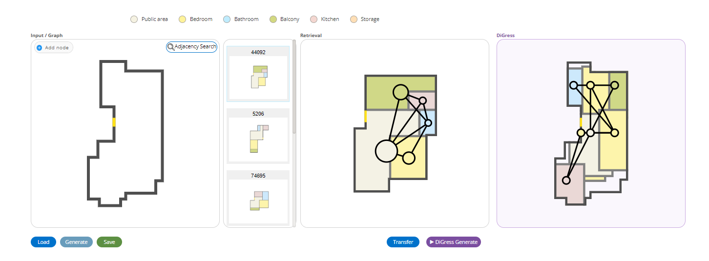

# DiscreteDiffFloorPlans

Constrained floor plan graph generation using discrete diffusion (DiGress), conditioned on a building boundary and optional room constraints. Generated graphs are rendered into floor plan images via a frozen Graph2Plan GNN.



---

## Overview

Two-stage pipeline:

1. **DiGress** — discrete graph diffusion model generating a room-type adjacency graph conditioned on a boundary shape (1000-dim Turning Function descriptor) and optional room count / adjacency constraints via classifier-free guidance.
2. **Graph2Plan (frozen GNN)** — converts the generated graph + boundary into a rendered floor plan image.

---

## Pretrained Checkpoint

```
https://huggingface.co/ahmadfraij/disdif/resolve/main/last-v1.ckpt
```

---

## Repository Structure

```
DiscreteDiffFloorPlans/
├── DiGress/                   # Diffusion model (training + sampling)
│   ├── src/
│   │   ├── main.py
│   │   ├── diffusion_model_discrete.py
│   │   └── datasets/
│   │       ├── floorplan_dataset.py
│   │       └── floorplan_constrained_dataset.py
├── Interface/                 # Django web interface + Graph2Plan GNN
├── scripts/
│   ├── inference_constrained.py
│   ├── evaluate.py
│   ├── run_training_constrained.sh
│   └── run_evaluation.sh
├── Dockerfile
└── requirements.txt
```

---

## Installation

```bash
conda create -n digress python=3.9
conda activate digress

pip install torch==2.1.0 torchvision==0.16.0 --index-url https://download.pytorch.org/whl/cu121
pip install torch_scatter torch_sparse torch_cluster -f https://data.pyg.org/whl/torch-2.1.0+cu121.html
pip install -r requirements.txt
```

---

## Data Preparation

```bash
wget https://github.com/HanHan55/Graph2plan/releases/download/data/Data.zip
unzip Data.zip
mkdir -p DiGress/data/floorplan/raw
cp path/to/data_train_converted.pkl DiGress/data/floorplan/raw/

python scripts/generate_tf.py \
    --pkl DiGress/data/floorplan/raw/data_train_converted.pkl \
    --out DiGress/data/floorplan/raw/tf_train.npy
```

---

## Training

```bash
cd DiGress
PYTHONPATH=src python src/main.py --config-name config_constrained
```

To resume from a checkpoint:

```bash
PYTHONPATH=src python src/main.py --config-name config_constrained \
    general.resume=checkpoints/floorplan_constrained/last.ckpt
```

---

## Inference

```bash
python scripts/inference_constrained.py \
    --ckpt checkpoints/floorplan_constrained/last.ckpt \
    --boundary "0,0 200,0 200,150 0,150" \
    --rooms "LivingRoom:1,Kitchen:1,Bathroom:2,MasterRoom:1" \
    --num-samples 4
```

**Available room types:** `LivingRoom`, `MasterRoom`, `Kitchen`, `Bathroom`, `DiningRoom`, `ChildRoom`, `StudyRoom`, `SecondRoom`, `GuestRoom`, `Balcony`, `Entrance`, `Storage`, `Wall`

---

## Evaluation

```bash
python scripts/evaluate.py \
    --ckpt checkpoints/floorplan_constrained/last.ckpt \
    --num_samples 500 \
    --out results/
```

---

## Web Interface

```bash
cd Interface
export DIGRESS_CKPT=path/to/last-v1.ckpt
python manage.py runserver
```

Open `http://127.0.0.1:8000`. Draw a boundary, click **Generate** for retrieval or **DiGress Generate** for the diffusion model.

---

## Docker (Northflank / Cloud)

```bash
docker build -t floorplan .

# Evaluate (default)
docker run --gpus all -v /your/storage:/mnt/storage floorplan

# Train constrained
docker run --gpus all -v /your/storage:/mnt/storage -e TRAINING_MODE=constrained floorplan

# Train baseline
docker run --gpus all -v /your/storage:/mnt/storage -e TRAINING_MODE=baseline floorplan
```

Checkpoint and data are downloaded automatically from HuggingFace on first run and cached on the volume.

---

## Citation

```bibtex
@article{vignac2022digress,
  title={DiGress: Discrete Denoising diffusion for graph generation},
  author={Vignac, Clement and Krawczuk, Igor and Siraudin, Antoine and Wang, Bohan and Cevher, Volkan and Frossard, Pascal},
  journal={arXiv preprint arXiv:2209.14734},
  year={2022}
}

@article{hu2020graph2plan,
  title={Graph2Plan: Learning Floorplan Generation from Layout Graphs},
  author={Hu, Ruizhen and Huang, Zeyu and Tang, Yuhan and Van Kaick, Oliver and Zhang, Hao and Huang, Hui},
  journal={ACM Transactions on Graphics},
  year={2020}
}
```
